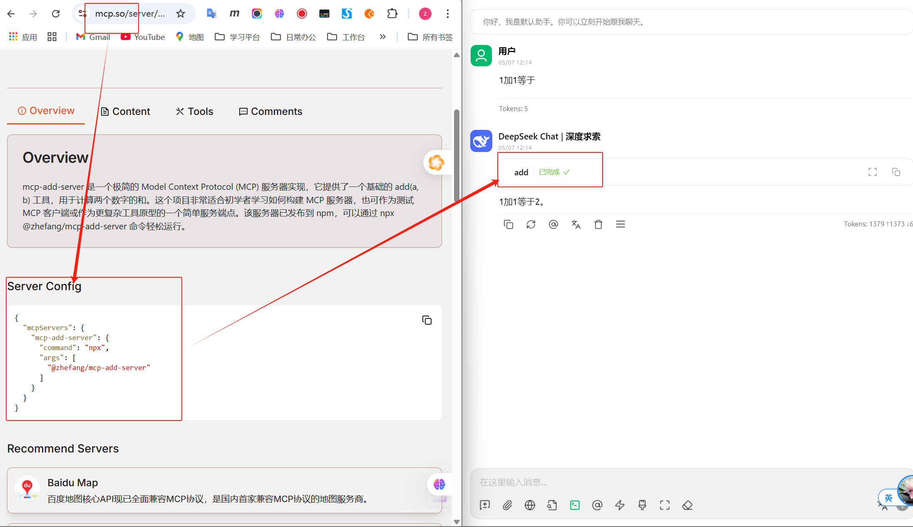

# MCP Add Server

A minimal Model Context Protocol (MCP) server that provides a simple `add(a, b)` tool. This project serves as a basic example of an MCP server implementation.

## Features

*   Implements a Model Context Protocol compliant server.
*   Provides a single tool: `add(a, b)` which returns the sum of two numbers.

## 实际运行效果 (Showcase)

下图展示了 `mcp-add-server` 在 `mcp.so` 服务发现平台上的配置信息，以及一个兼容 MCP 的聊天机器人 (例如 DeepSeek Chat) 成功调用本服务器的 `add` 工具来执行加法运算的场景：

[](./images/mcp-add-server-showcase.png)

*   **左侧**: `mcp-add-server` 在 `mcp.so` 上的信息，展示了其概述和启动配置。
*   **右侧**: 一个 MCP 客户端 (聊天机器人) 接收到用户关于加法的请求后，调用了 `@zhefang/mcp-add-server` 提供的 `add` 工具，并正确返回了计算结果。

这清晰地演示了遵循 Model Context Protocol 的服务器和客户端之间如何无缝集成和协作。

## Prerequisites

*   Node.js (version 18.x.x or higher recommended)
*   npm (comes with Node.js)

## Installation

1.  Clone the repository:
    ```bash
    git clone <你的仓库URL> # 当你推送到 GitHub 后，替换这里的 URL
    cd mcp-add-server
    ```
2.  Install dependencies:
    ```bash
    npm install
    ```

## Usage

There are several ways to run the `mcp-add-server`:

**1. Using `npx` (Recommended for most users):**

If you have Node.js and npm installed, you can run the server directly without cloning or installing globally:

```bash
npx mcp-add-server
```
This command will download the latest version of `mcp-add-server` (if not already cached) and execute it.

**2. Running from a cloned repository:**

After cloning the repository and installing dependencies (see [Installation](#installation)):

```bash
npm start
```
This uses the `start` script defined in `package.json`.

**3. Global installation (for frequent use or development):**

You can install the package globally:
```bash
npm install -g .  # From the cloned repository directory
# or once published to npm:
# npm install -g mcp-add-server
```
Then you can run it from any directory:
```bash
mcp-add-server
```

**4. Local linking for development:**
In the project's root directory, run `npm link`. This will make the `mcp-add-server` command available globally, pointing to your local project files.
```bash
# In project directory
npm link

# Then, in any directory:
mcp-add-server
```

Once the server is running (regardless of the method used), it will be available to MCP clients.

### Example Tool Call (Conceptual)

An MCP client could call the `add` tool like this (specifics depend on the client implementation):

```json
{
  "tool_name": "add",
  "arguments": {
    "a": 5,
    "b": 3
  }
}
```

The server would respond with:
```json
{
  "result": 8
}
```

## Running Tests

*(When tests are added, describe how to run them here)*
```bash
npm test
```
*(Currently, `npm test` will output "Error: no test specified". Update the `test` script in `package.json` when tests are added.)*

## Project Structure

```
mcp-add-server/
├── .git/               # Git directory
├── .gitignore          # Specifies intentionally untracked files that Git should ignore
├── .cursor/            # Cursor specific files (if any)
├── node_modules/       # Project dependencies
├── src/                # Source code
│   └── server.js       # Main server logic
├── bin.js              # Executable for the server
├── LICENSE             # Project license
├── package-lock.json   # Records exact versions of dependencies
├── package.json        # Project metadata and dependencies
└── README.md           # This file
```

## Contributing

Contributions are welcome! Please feel free to submit a pull request or open an issue.

## License

This project is licensed under the [MIT License](LICENSE).
